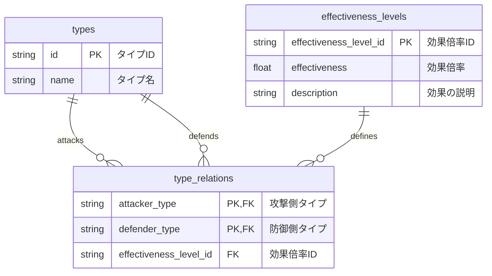

まずは、この記事を書こうと思ったきっかけからお話ししましょう。

## きっかけ: ポケモンのタイプ相性

みなさんご存知の通り、ポケットモンスター通称ポケモンは発売以来、世界中の多くの人々に愛されてきました。
そして、ポケットモンスターシリーズは今年で30周年を迎えます。
そんな長い歴史の中で、ポケモンのゲームデザインは多くの変化と進化を遂げてきました。

特に、ポケモンの **タイプ相性** は、ゲームバランスを保つために非常に重要な要素です。
ポケモンには様々なタイプ（例: ほのお、みず、くさ、でんきなど）があり、それぞれのタイプには相性があります。
例えば、ほのおタイプはくさタイプに強く、みずタイプには弱いといった具合です。
このタイプ相性のシステムは、プレイヤーに戦略的な選択を促し、ゲームの深みを増しています。

タイプ相性システムは、ポケモンシリーズの初期から存在しており、
新しいタイプの追加や特定のタイプに対する効果の調整など、細かな変更は行われてきましたが、大枠の設計は一貫して維持されています。
これは、長期にわたる運用を見据えた優れた設計の一例と言えるでしょう。

今回の記事では、ポケモンのタイプ相性システムから学ぶ、長期運用を見据えたソフトウェア設計の考え方について考察します。

## この記事で学べること

- ポケモンのタイプ相性システムのデータベース設計
- 長期運用を支える4つの設計原則（関心の分離、正規化、拡張性、後方互換性）
- 複合タイプなど複雑な要件への対応方法
- ビジネス要件の変更に強いシステム設計の考え方

## 初期のポケモンのタイプの種類と相性

ポケモンシリーズの初期、具体的には『ポケットモンスター 赤・緑』では、以下の15種類のタイプが存在していました。

- ノーマル
- ほのお
- みず
- くさ
- でんき
- こおり
- かくとう
- どく
- じめん
- ひこう
- エスパー
- むし
- いわ
- ゴースト
- ドラゴン

これらのタイプは、それぞれ特定の相性関係を持っており、例えば、ほのおタイプはくさタイプに対して2倍のダメージを与え、みずタイプには0.5倍のダメージしか与えられません。（※一部の外伝作品（ポケモン不思議のダンジョンなど）では倍率が異なる場合があります）
また、ノーマルタイプとゴーストタイプの間には効果がない（0倍）といった特殊な相性も存在します。

ポケモンによっては、複数のタイプを持つものもおり、これによりタイプ相性の計算がさらに複雑になります。

このシステムは、プレイヤーに戦略的な選択を促し、ゲームの深みを増す役割を果たしていました。

タイプ相性の詳細については [相性 - ポケモンWiki](https://wiki.xn--rckteqa2e.com/wiki/%E7%9B%B8%E6%80%A7) を参照してください。

## タイプ相性を DB 設計に落とし込む

ポケモンのタイプ相性システムをデータベース設計に落とし込む場合、以下のようなテーブル構造が考えられます。



この設計では、 `types` テーブルがポケモンのタイプを管理し、 `type_relations` テーブルが各タイプ間の相性関係を定義します。
`effectiveness_levels` テーブルは、効果倍率の詳細を管理します。

実際にデータを定義すると、以下のようになります。

```sql
-- types テーブルの作成
CREATE TABLE types (
    id VARCHAR(50) PRIMARY KEY,
    name VARCHAR(100) NOT NULL
);

-- effectiveness_levels テーブルの作成
CREATE TABLE effectiveness_levels (
    effectiveness_level_id VARCHAR(50) PRIMARY KEY,
    effectiveness FLOAT NOT NULL,
    description VARCHAR(255) NOT NULL
);

-- type_relations テーブルの作成
CREATE TABLE type_relations (
    attacker_type VARCHAR(50),
    defender_type VARCHAR(50),
    effectiveness_level_id VARCHAR(50),
    PRIMARY KEY (attacker_type, defender_type),
    FOREIGN KEY (attacker_type) REFERENCES types(id),
    FOREIGN KEY (defender_type) REFERENCES types(id),
    FOREIGN KEY (effectiveness_level_id) REFERENCES effectiveness_levels(effectiveness_level_id)
);

-- types テーブルのデータ
INSERT INTO types (id, name) VALUES
('fire', 'ほのお'),
('water', 'みず'),
('grass', 'くさ'),
('electric', 'でんき');

-- effectiveness_levels テーブルのデータ
INSERT INTO effectiveness_levels (effectiveness_level_id, effectiveness, description) VALUES
('double', 2.0, 'こうかはばつぐんだ！'),
('half', 0.5, 'こうかはいまひとつのようだ'),
('none', 0.0, 'こうかがないようだ...');

-- type_relations テーブルのデータ
INSERT INTO type_relations (attacker_type, defender_type, effectiveness_level_id) VALUES
('fire', 'fire', 'half'),
('fire', 'water', 'half'),
('fire', 'grass', 'double'),
('water', 'fire', 'double'),
('water', 'water', 'half'),
('water', 'grass', 'half'),
('grass', 'fire', 'half'),
('grass', 'water', 'double'),
('grass', 'grass', 'half'),
('electric', 'water', 'double'),
('electric', 'grass', 'half'),
('electric', 'electric', 'half');
```

この設計により、新しいタイプの追加や相性関係の変更が容易になります。

## タイプの追加

ポケモンシリーズの進化とともに、新しいタイプが追加され、『ポケットモンスター 金・銀・クリスタル』であくタイプとはがねタイプ、『ポケットモンスター X・Y』ではフェアリータイプが追加されました。
これにより、タイプ相性システムはさらに複雑化しましたが、前述のデータベース設計により、新しいタイプの追加は容易に行うことができます。

例えば、あくタイプとはがねタイプを追加する場合、以下のようにタイプのデータと相性関係を挿入するだけです。

```sql
-- types テーブルに新しいタイプを追加
INSERT INTO types (id, name) VALUES
('dark', 'あく'),
('steel', 'はがね');

-- type_relations テーブルに新しいタイプの相性関係を追加（受け側は項目が多いため省略）
INSERT INTO type_relations (attacker_type, defender_type, effectiveness_level_id) VALUES
('dark', 'psychic', 'double'),
('dark', 'ghost', 'double'),
('dark', 'fighting', 'half'),
('dark', 'dark', 'half'),
('dark', 'steel', 'half'),
('steel', 'rock', 'double'),
('steel', 'ice', 'double'),
('steel', 'fire', 'half'),
('steel', 'water', 'half'),
('steel', 'electric', 'half'),
('steel', 'steel', 'half');
```

このように、タイプ相性システムの設計が柔軟で拡張性が高いため、新しいタイプの追加や相性関係の変更が容易に行えます。

## 効果倍率の変更

ポケモンシリーズでは、ゲームバランスを保つために、特定のタイプに対する効果倍率が変更されることがありました。
例えば、『ポケットモンスター X・Y』では、フェアリータイプの追加に伴い、ドラゴンタイプの調整が行われました。
それまで強力だったドラゴンタイプに対して、フェアリータイプが効果抜群となる相性が追加され、ゲームバランスが改善されました。

このような変更も、前述のデータベース設計により、容易に対応できます。

以下のように、 `type_relations` テーブルに新しい相性データを追加するだけです。

```sql
-- フェアリータイプを追加
INSERT INTO types (id, name) VALUES ('fairy', 'フェアリー');

-- フェアリータイプが攻撃する場合の相性関係
INSERT INTO type_relations (attacker_type, defender_type, effectiveness_level_id) VALUES
('fairy', 'dragon', 'double'),     -- フェアリー → ドラゴンは効果抜群
('fairy', 'fighting', 'double'),   -- フェアリー → かくとうは効果抜群
('fairy', 'dark', 'double'),       -- フェアリー → あくは効果抜群
('fairy', 'fire', 'half'),         -- フェアリー → ほのおは効果いまひとつ
('fairy', 'poison', 'half'),       -- フェアリー → どくは効果いまひとつ
('fairy', 'steel', 'half');        -- フェアリー → はがねは効果いまひとつ

-- フェアリータイプが攻撃を受ける場合の相性関係
INSERT INTO type_relations (attacker_type, defender_type, effectiveness_level_id) VALUES
('poison', 'fairy', 'double'),     -- どく → フェアリーは効果抜群
('steel', 'fairy', 'double'),      -- はがね → フェアリーは効果抜群
('fighting', 'fairy', 'half'),     -- かくとう → フェアリーは効果いまひとつ
('bug', 'fairy', 'half'),          -- むし → フェアリーは効果いまひとつ
('dark', 'fairy', 'half'),         -- あく → フェアリーは効果いまひとつ
('dragon', 'fairy', 'none');       -- ドラゴン → フェアリーは効果なし
```

この設計により、新しいタイプの追加とそれに伴う既存タイプとの相性関係の定義が簡単に行え、長期にわたる運用を見据えた柔軟なシステムとなっています。

## 複合タイプによる戦略性の向上

ポケモンのタイプは、単一タイプだけでなく、複数のタイプを持つポケモンも存在します。
タイプ相性システムは、これらの複合タイプに対しても柔軟に対応しています。

例えば、みず・ひこうタイプのポケモンは、でんきタイプの攻撃に対して4倍のダメージを受けますが、くさタイプの攻撃に対しては0.25倍のダメージしか受けません。

これを実装するには、ポケモンテーブルとタイプテーブルを関連付ける中間テーブルが必要です。

```sql
-- pokemon テーブルの作成
CREATE TABLE pokemon (
    id VARCHAR(50) PRIMARY KEY,
    name VARCHAR(100) NOT NULL,
    generation INT NOT NULL
);

-- pokemon_types テーブルの作成（複合タイプに対応）
CREATE TABLE pokemon_types (
    pokemon_id VARCHAR(50),
    type_id VARCHAR(50),
    type_order INT NOT NULL,  -- 1:第一タイプ、2:第二タイプ
    PRIMARY KEY (pokemon_id, type_order),
    FOREIGN KEY (pokemon_id) REFERENCES pokemon(id),
    FOREIGN KEY (type_id) REFERENCES types(id)
);

-- データ例
INSERT INTO pokemon (id, name, generation) VALUES
('golduck', 'ゴルダック', 1),
('gyarados', 'ギャラドス', 1);

INSERT INTO pokemon_types (pokemon_id, type_id, type_order) VALUES
('golduck', 'water', 1),  -- ゴルダック：みず
('gyarados', 'water', 1),   -- ギャラドス：みず
('gyarados', 'flying', 2);  -- ギャラドス：ひこう（複合タイプ）
```

複合タイプのダメージ計算は、各タイプに対する効果倍率を乗算することで実現できます。

```sql
-- ギャラドス（みず・ひこう複合）がでんきタイプの攻撃を受ける場合
-- 期待値: 4倍（2倍 × 2倍）

-- 各タイプに対する効果倍率を取得
SELECT pt.type_id, el.effectiveness
FROM pokemon_types pt
JOIN type_relations tr ON pt.type_id = tr.defender_type
JOIN effectiveness_levels el ON tr.effectiveness_level_id = el.effectiveness_level_id
WHERE pt.pokemon_id = 'gyarados' AND tr.attacker_type = 'electric';
-- 結果: water(2.0), flying(2.0)

-- 実際の倍率計算はアプリケーション側で実装
-- total_effectiveness = 2.0 × 2.0 = 4.0
```

:::message
SQL標準には`PRODUCT`関数が存在しないため、実際の実装では各タイプの効果倍率を取得後、アプリケーション側で乗算処理を行います。または、データベースによっては`EXP(SUM(LN(effectiveness)))`のような数学的トリックを使用することもできます。
:::

これにより、タイプ相性の計算がさらに複雑化し、プレイヤーに多様な戦略的選択肢を提供しています。

## 長期運用を見据えたソフトウェア設計の原則

ポケモンのタイプ相性システムから、私たちが学べるソフトウェア設計の原則は以下の通りです。

### 1. **関心の分離**

タイプ、相性関係、効果倍率を別々のテーブルに分離することで、それぞれの変更が他に影響を最小限に抑えています。

### 2. **正規化によるデータの一貫性**

効果倍率を一元管理することで、同じ値の重複登録を防ぎ、変更時の影響範囲を限定できます。

### 3. **拡張性の確保**

新しいタイプや効果倍率の追加が容易な設計により、ゲームの進化に柔軟に対応できます。

### 4. **ビジネス変更への対応**

ゲームバランス調整による相性の変更も、データ更新だけで実現できます。

この設計は、ソフトウェア開発においても参考になります。

複数の機能やモジュールが組み合わさる場合でも、各要素の相互作用を考慮した設計を行うことで、システム全体の柔軟性と拡張性を高めることができます。

## 後方互換性の確保

ポケモンのタイプ相性システムは、タイプの追加や効果倍率の変更はありましたが、既存のタイプの削除は行われていません。
これにより、既存のポケモンが次世代のゲームでも引き続き使用できるようになっています。

この設計方針は、ソフトウェア開発においても重要です。

例えば、 API のバージョンアップやデータベースのスキーマ変更を行う際には、後方互換性を確保することが求められます。

既存の機能やデータを維持しつつ、新しい機能を追加することで、ユーザーにとっての利便性を保ち、システムの安定性を確保できます。

## まとめ

ポケモンのタイプ相性システムは、長期にわたる運用を見据えた優れたソフトウェア設計の一例です。
その柔軟で拡張性の高い設計により、新しいタイプの追加や効果倍率の変更が容易に行え、複合タイプによる戦略性の向上や後方互換性の確保も実現しています。

これらの設計原則は、ソフトウェア開発においても非常に有用であり、システムの柔軟性、拡張性、安定性を高めるための参考となります。

ポケモンのタイプ相性システムから学んだ設計原則から、長期運用を見据えたソフトウェアの開発のヒントを得ていただければ幸いです。
